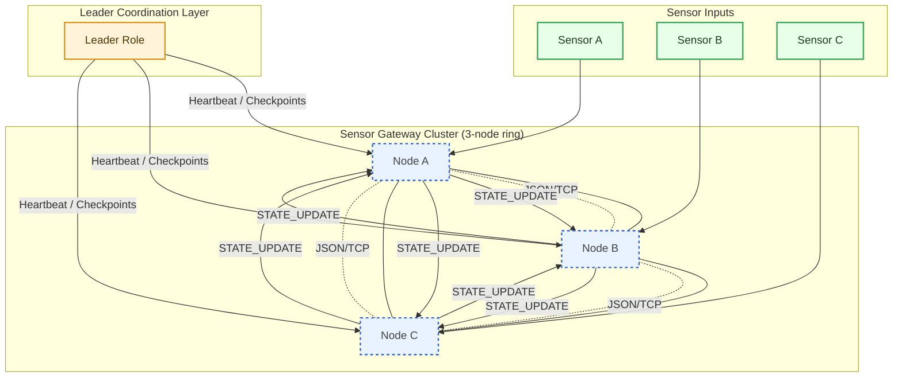

```mermaid
flowchart TB

%% --------------------------
%% STYLE DEFINITIONS
%% --------------------------
classDef node fill:#e9f2ff,stroke:#2f65d6,stroke-width:2px,color:#0b1f45;
classDef leader fill:#fff3d9,stroke:#d99723,stroke-width:2px,color:#4a3800;
classDef sensor fill:#e8ffe8,stroke:#3aa85c,stroke-width:2px,color:#1f3b22;
classDef traffic stroke-dasharray: 4 4,color:#444;

%% ==========================
%% TOP LAYER — SENSORS
%% ==========================
subgraph SENSORS ["Sensor Inputs"]
direction LR
    S1["Sensor A"]:::sensor
    S2["Sensor B"]:::sensor
    S3["Sensor C"]:::sensor
end

%% ==========================
%% MIDDLE LAYER — CLUSTER
%% ==========================
subgraph CLUSTER ["Sensor Gateway Cluster (3-node ring)"]
direction LR
    A["Node A"]:::node
    B["Node B"]:::node
    C["Node C"]:::node
end

%% SENSOR → NODE MAPPING
S1 --> A
S2 --> B
S3 --> C

%% NODE INTERLINKS (Physical / Sync)
A --- B
B --- C
C --- A

%% Logical / Protocol Paths
A -. "JSON/TCP" .- B:::traffic
B -. "JSON/TCP" .- C:::traffic
C -. "JSON/TCP" .- A:::traffic

%% ==========================
%% BOTTOM LAYER — LEADER
%% ==========================
subgraph CONTROL ["Leader Coordination Layer"]
direction TB
    L["Leader Role"]:::leader
end

L -->|Heartbeat / Checkpoints| A
L -->|Heartbeat / Checkpoints| B
L -->|Heartbeat / Checkpoints| C

%% ==========================
%% STATE PROPAGATION
%% ==========================
A -->|STATE_UPDATE| B
A -->|STATE_UPDATE| C
B -->|STATE_UPDATE| A
B -->|STATE_UPDATE| C
C -->|STATE_UPDATE| A
C -->|STATE_UPDATE| B


```