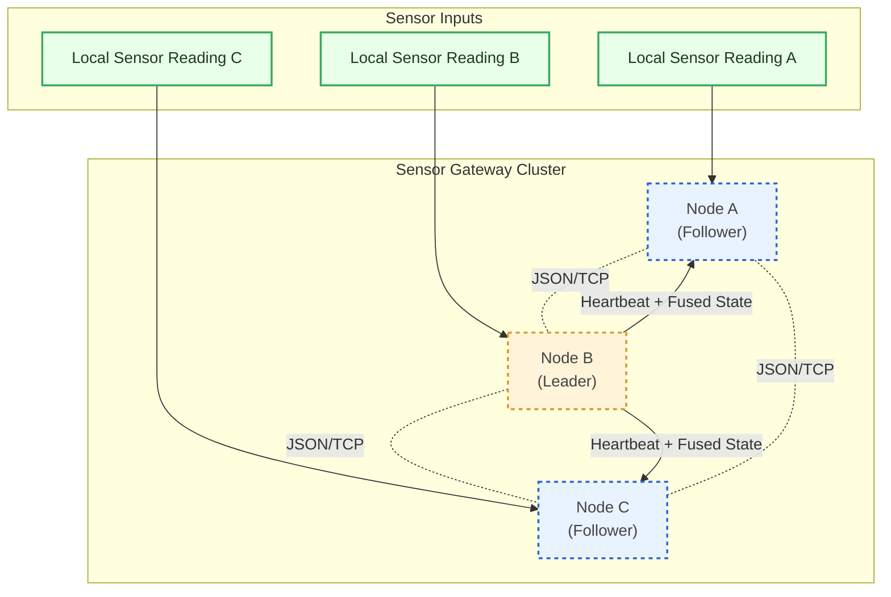

```mermaid
flowchart TB

%% --------------------------
%% STYLE DEFINITIONS
%% --------------------------
classDef node fill:#e9f2ff,stroke:#2f65d6,stroke-width:2px,color:#0b1f45;
classDef leader fill:#fff3d9,stroke:#d99723,stroke-width:2px,color:#4a3800;
classDef sensor fill:#e8ffe8,stroke:#3aa85c,stroke-width:2px,color:#1f3b22;
classDef traffic stroke-dasharray: 4 4,color:#444;

%% ==========================
%% TOP LAYER — SENSORS
%% ==========================
subgraph SENSORS ["Sensor Inputs"]
direction LR
    S1["Local Sensor Reading A"]:::sensor
    S2["Local Sensor Reading B"]:::sensor
    S3["Local Sensor Reading C"]:::sensor
end

%% ==========================
%% CLUSTER
%% ==========================
subgraph CLUSTER ["Sensor Gateway Cluster"]
direction LR
    A["Node A\n(Follower)"]:::node
    B["Node B\n(Leader)"]:::leader
    C["Node C\n(Follower)"]:::node
end

%% SENSOR → NODE
S1 --> A
S2 --> B
S3 --> C

%% CONTROL PLANE (ELECTION / HEARTBEATS)
A -. "JSON/TCP" .- B:::traffic
B -. "JSON/TCP" .- C:::traffic
C -. "JSON/TCP" .- A:::traffic

%% DATA / STATE FLOW
B -->|Heartbeat + Fused State| A
B -->|Heartbeat + Fused State| C


```