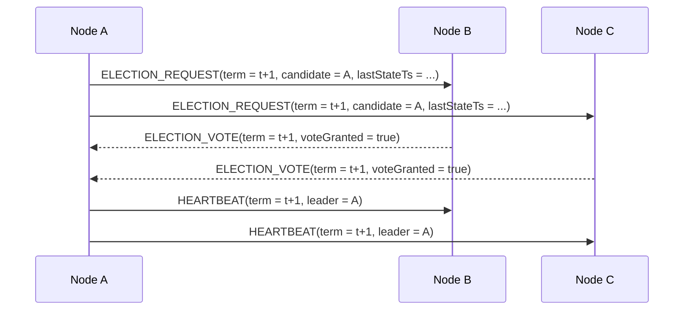

```mermaid
sequenceDiagram
    %% ===========================
    %% PARTICIPANTS
    %% ===========================
    participant A as Node A
    participant B as Node B
    participant C as Node C

    %% ===========================
    %% ELECTION TIMEOUT
    %% ===========================

    A->>B: ELECTION_REQUEST(term = t+1, candidate = A, lastStateTs = ...)
    A->>C: ELECTION_REQUEST(term = t+1, candidate = A, lastStateTs = ...)

    B-->>A: ELECTION_VOTE(term = t+1, voteGranted = true)
    C-->>A: ELECTION_VOTE(term = t+1, voteGranted = true)


    %% ===========================
    %% LEADER HEARTBEATS
    %% ===========================
    A->>B: HEARTBEAT(term = t+1, leader = A)
    A->>C: HEARTBEAT(term = t+1, leader = A)


```
