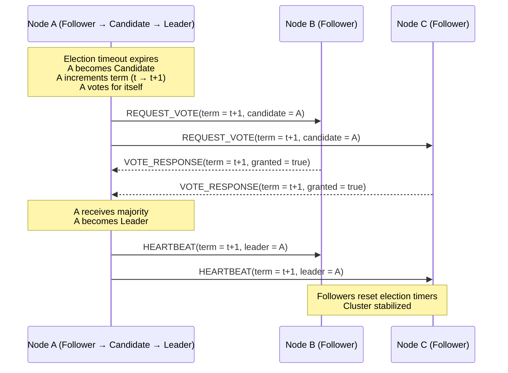

```mermaid
sequenceDiagram
    %% ======================================
    %% PARTICIPANTS
    %% ======================================
    participant A as Node A (Follower → Candidate → Leader)
    participant B as Node B (Follower)
    participant C as Node C (Follower)

    %% ======================================
    %% ELECTION TIMEOUT
    %% ======================================
    Note over A: Election timeout expires<br>A becomes Candidate<br>A increments term (t → t+1)<br>A votes for itself

    %% SEND REQUEST_VOTE
    A->>B: REQUEST_VOTE(term = t+1, candidate = A)
    A->>C: REQUEST_VOTE(term = t+1, candidate = A)

    %% RECEIVE VOTES
    B-->>A: VOTE_RESPONSE(term = t+1, granted = true)
    C-->>A: VOTE_RESPONSE(term = t+1, granted = true)

    Note over A: A receives majority<br>A becomes Leader

    %% ======================================
    %% LEADER HEARTBEATS
    %% ======================================
    A->>B: HEARTBEAT(term = t+1, leader = A)
    A->>C: HEARTBEAT(term = t+1, leader = A)

    Note over B,C: Followers reset election timers<br>Cluster stabilized
```
